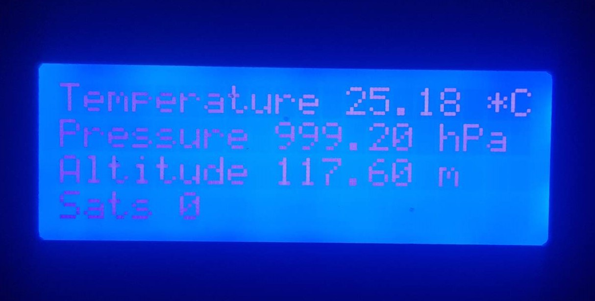
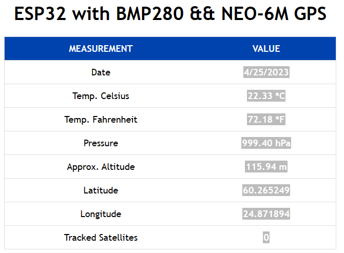

## Table of Contents
<!-- TOC -->
- [About the Project](#about-the-project)
- [Hardware Schematic](#hardware-schematic)
- [Software Installation](#software-installation)    
- [Result](#result)
<!-- TOC -->
## About the Project  
A simple hobby project with BMP280 sensorm, NEO-6M GPS module, I2C LCD  and ESP32 microcontroller. Using BMP280 sensor to read temperature,pressure and altitude. GPS module to get latitude, longitude and number of sattellites being tracked. Eventually, create a web sever to visualize all the information from the sensors.
## Hardware Schematic  
A multiple slaves I2C communication protocol to master ESP32 is designed to read data from BMP280 and write data to LCD. Serial commnunication UART1 is used to send data through serial moniotr from board to computer and UART2 interface is used to connect GPS module and ESP32.  
| ESP32 pin | GPS Neo-6M | BMP280 | LCD |
| ---  | --- | --- | --- |
| VIN (5V) | | | :heavy_check_mark: |
| 3.3 (V)  | :heavy_check_mark: | :heavy_check_mark: | |
|SDA (D21) | | :heavy_check_mark: | :heavy_check_mark: | |
|SCL (D22) | | :heavy_check_mark: | :heavy_check_mark: | |
|RX2 (16)| :heavy_check_mark: | | |
|TX2 (17)| :heavy_check_mark: | | |
| GND| :heavy_check_mark: | :heavy_check_mark:| :heavy_check_mark:|  
Hardware requirements:  
- [ESP32-WROOM-32](https://www.espressif.com/en/products/modules/esp32)  
- [Pressure Sensor BMP280](https://www.bosch-sensortec.com/products/environmental-sensors/pressure-sensors/bmp280/)  
- [NEO-6M GPS Module](https://www.u-blox.com/en/product/neo-6-series)  
- LCD 20x4
## Software Installation
Arduino IDE software is prerequesite. To install the ESP32 board in Arduino IDE: 
* File > Preferences
* Enter URLs Additional Boards Manager URLs field > Click “OK”
```bash
  https://raw.githubusercontent.com/espressif/arduino-esp32/gh-pages/package_esp32_index.json
```
* Tools > Board > Board Manager > Search for `ESP32` > Install  `ESP32 by Espressif Systems`
* Select the Ports
---
>Note: 
 If you don’t see the COM Port in your Arduino IDE, you need to install the [CP210x USB to UART Bridge VCP Drivers](https://www.silabs.com/developers/usb-to-uart-bridge-vcp-drivers)
---  
Install the following libraries:  
* Adafruit_BMP280
* TinyGPS++
* LiquidCrystal_I2C
---
>Note: 
In case the sensors do not work, check the addresses of those sensors by running this [I2C scanner sketch](https://raw.githubusercontent.com/RuiSantosdotme/Random-Nerd-Tutorials/master/Projects/LCD_I2C/I2C_Scanner.ino). Then replace correct addresses.
---  
To access to the web sever, copy and paste the ESP32 IP address to the web browser.
## Result

